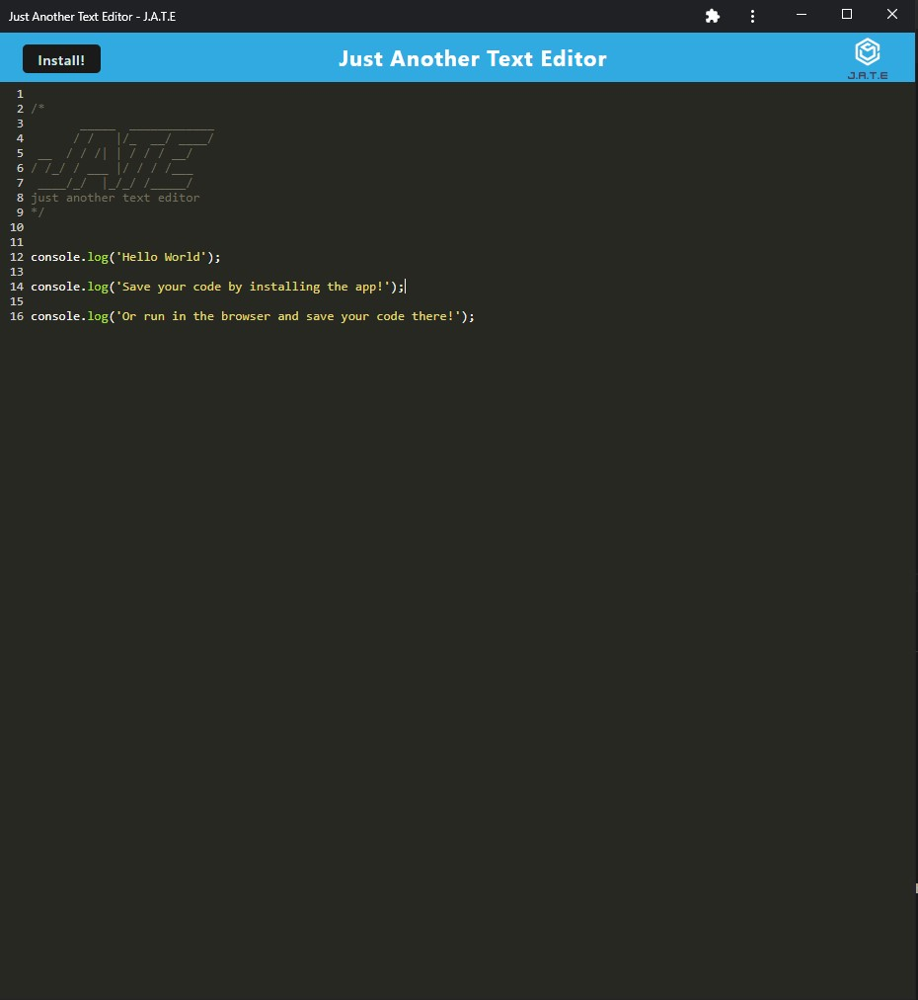
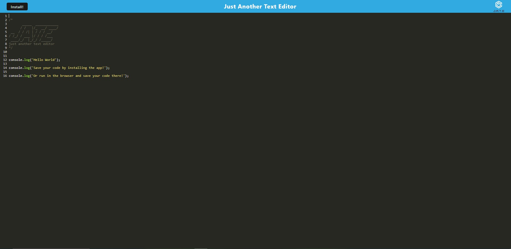

# PWA-Text-Editor

## Table of Contents

- [Description](#description)
- [Installation](#installation)
- [Screenshot](#screenshot)
- [Deployed](#deployed)
- [Usage](#usage)
- [Licenses](#license)
- [Questions](#questions)
- [Credits](#credits)

## Description

This is a text editor that uses PWA criteria. This application can be used in the browser or installed while running offline.

## Installation

- This app requires Node.js to install dependencies.
- Start by cloning this repository to your local machine `git clone`. Run `npm install` for dependencies.
- `cd` to the client folder and run `npm run build` in the command line.
- Go into the "dist" folder and locate the index.html file, once located run the file in live server.
- Once the file is started in live server, your browser should open. Click the "Install" button in the left corner to install the app!

## Screenshot

### Installed App

### Web browser

## Deployed

This application is deployed through Heroku click [here](https://pwa-text-editor-55.herokuapp.com/)

## Usage

This app allows users to keep track of notes in a text editor format. The user can either use the browser or install to their local machine.

## Licenses

This project is covered under the MIT license. click the license button at the top to learn more.

https://opensource.org/licenses/MIT

## Questions

Questions regarding this project?
GitHub: https://github.com/Ryebread5555
Email: rypetty55@gmail.com

## Credits

- JavaScript
- NodeJS
- Heroku
- Starter code provided by click [here](https://github.com/coding-boot-camp/cautious-meme)
